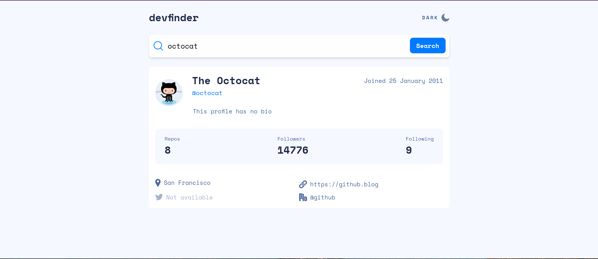
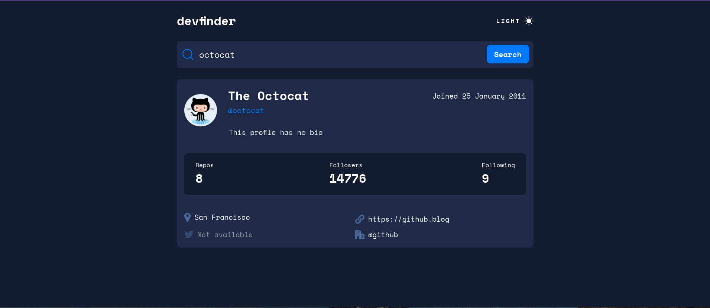
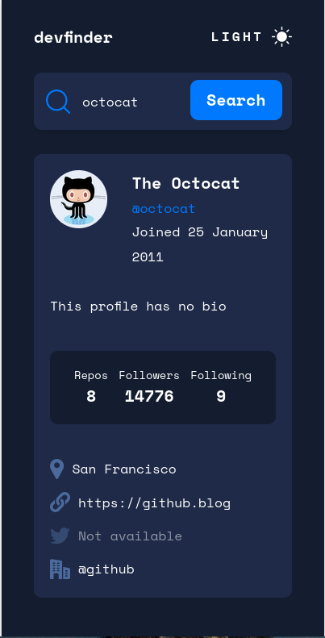

# Frontend Mentor - GitHub user search app solution

This is a solution to the [GitHub user search app challenge on Frontend Mentor](https://www.frontendmentor.io/challenges/github-user-search-app-Q09YOgaH6). Frontend Mentor challenges help you improve your coding skills by building realistic projects. 

## Table of contents

- [Overview](#overview)
  - [The challenge](#the-challenge)
  - [Screenshot](#screenshot)
  - [Links](#links)
- [My process](#my-process)
  - [Built with](#built-with)
  - [What I learned](#what-i-learned)
  - [Continued development](#continued-development)
  - [Useful resources](#useful-resources)
- [Author](#author)

## Overview

Web application that searches for users in the GitHub API by username and displays their information.

### The challenge

Users should be able to:

- View the optimal layout for the app depending on their device's screen size
- See hover states for all interactive elements on the page
- Search for GitHub users by their username
- See relevant user information based on their search
- Switch between light and dark themes
- **Bonus**: Have the correct color scheme chosen for them based on their computer preferences. _Hint_: Research `prefers-color-scheme` in CSS.

### Screenshot

### Links

- Solution URL: [https://www.frontendmentor.io/solutions/github-user-search-app-with-next-and-tailwind-css-noj9HdQ201]
- Live Site URL: [https://github-user-search-app-ten-liard.vercel.app/]

## My process

### Built with

- Semantic HTML5 markup
- Mobile-first workflow
- [Tailwind CSS](https://tailwindcss.com/) - CSS Framework
- [React](https://reactjs.org/) - JS library
- [Next.js](https://nextjs.org/) - React framework

### What I learned

I learned how to implement switching between light and dark theme. How to use useEffect to consume from an API once the component has been rendered.

### Continued development

I would like to focus on using context rather than passing props between components. 

### Useful resources

- [Example resource 1](https://github.com/vercel/next.js/discussions/22388) - This helped me for because I had a warning that said: extra attributes from the server. 

## Author

- Website - [Laura Elena Mesa](https://portfolio-app-three-red.vercel.app/)
- Frontend Mentor - [@laurymesa01](https://www.frontendmentor.io/profile/laurymesa01)
- LinkedIn - [@lauraelenamesa](https://www.linkedin.com/in/lauraelenamesa/)

